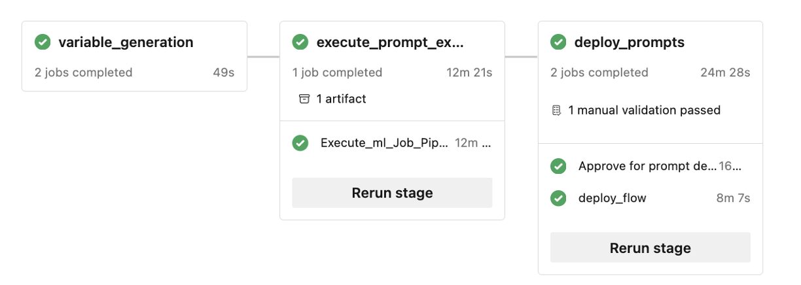
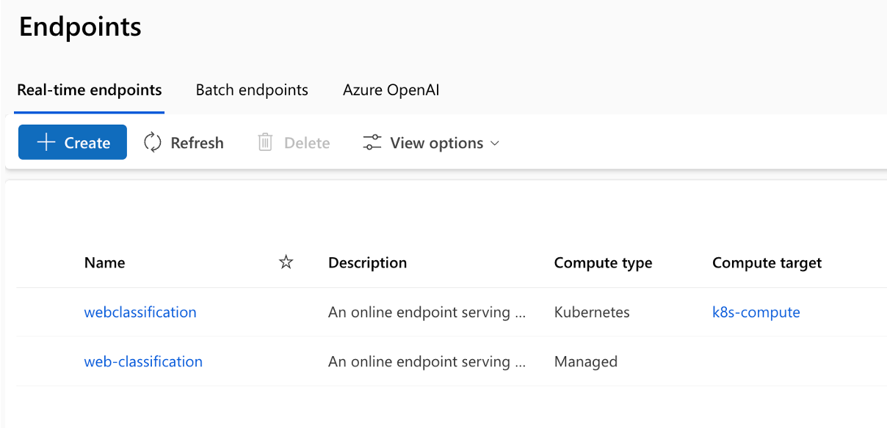

# Open Hack - Challenge 7: LLMOps in Visual Studio Code
[](https://github.com/microsoft/llmops-promptflow-template)

## Introduction

In this challenge, you will learn about LLMOps using Visual Studio Code and GitHub Actions. You will learn how to create a new project, create a new environment, and deploy your model using the Azure Machine Learning service.

- [Integrate Prompt Flow with LLMOps](https://learn.microsoft.com/en-us/azure/machine-learning/prompt-flow/how-to-integrate-with-llm-app-devops?view=azureml-api-2&tabs=cli)

- [LLMOps with GitHub Actions](https://github.com/Azure/llmops-gha-demo)

## LLMOps Prompt Flow Features

LLMOps with prompt flow is a "LLMOps template and guidance" to help you build LLM-infused apps using prompt flow. It provides the following features:

- **Centralized Code Hosting**: This repo supports hosting code for multiple flows based on prompt flow, providing a single repository for all your flows. Think of this platform as a single repository where all your prompt flow code resides. It's like a library for your flows, making it easy to find, access, and collaborate on different projects.

- **Lifecycle Management**: Each flow enjoys its own lifecycle, allowing for smooth transitions from local experimentation to production deployment. Screenshot of pipeline.



- **Variant and Hyperparameter Experimentation**: Experiment with multiple variants and hyperparameters, evaluating flow variants with ease. Variants and hyperparameters are like ingredients in a recipe. This platform allows you to experiment with different combinations of variants across multiple nodes in a flow.

- **Multiple Deployment Targets**: The repo supports deployment of flows to Azure App Services, Kubernetes, Azure Managed computes driven through configuration ensuring that your flows can scale as needed. It also generates Docker images infused with Flow compute session and your flows for deployment to any target platform and Operating system supporting Docker. Screenshot of endpoints.



- **A/B Deployment**: Seamlessly implement A/B deployments, enabling you to compare different flow versions effortlessly. As in traditional A/B testing for websites, this platform facilitates A/B deployment for prompt flow. This means you can effortlessly compare different versions of a flow in a real-world setting to determine which performs best. Screenshot of deployments.


- **Many-to-many dataset/flow relationships** Accommodate multiple datasets for each standard and evaluation flow, ensuring versatility in flow test and evaluation. The platform is designed to accommodate multiple datasets for each flow.

- **Conditional Data and Model registration**: The platform creates a new version for dataset in Azure Machine Learning Data Asset and flows in model registry only when there's a change in them, not otherwise.

## Fork and configure the repo

Follow the [guidelines](https://github.com/microsoft/llmops-promptflow-template/blob/main/docs/github_workflows_how_to_setup.md#set-up-github-repo) to create a forked repo in your GitHub organization. This [repo](https://github.com/microsoft/llmops-promptflow-template) uses two branches - main and development for code promotions and execution of pipelines in lieu of changes to code in them.

Follow then the [guidelines](https://learn.microsoft.com/en-us/azure/machine-learning/prompt-flow/how-to-end-to-end-llmops-with-prompt-flow?view=azureml-api-2#set-up-authentication-between-github-and-azure) to set up authentication between GitHub and Azure.

### Test the pipelines

Follow the [guidelines](https://github.com/microsoft/llmops-promptflow-template/blob/main/docs/github_workflows_how_to_setup.md#cloning-the-repos) to test the pipelines. The steps are:

1. Raise a PR (Pull Request) from a feature branch to development branch.
2. The PR pipeline should execute automatically as a result of branch policy configuration.
3. The PR is then merged to the development branch.
4. The associated 'dev' pipeline is executed. This results in full CI and CD execution and results in provisioning or updating of existing Azure Machine Learning Endpoints.

The test outputs should be similar to the ones shown [here](https://github.com/microsoft/llmops-promptflow-template/blob/main/docs/github_workflows_how_to_setup.md#example-prompt-run-evaluation-and-deployment-scenario).

## Local Execution

To harness the capabilities of the local execution, follow these installation steps:

1. Clone the Repository: Begin by cloning the template's repository from its [GitHub repository](https://github.com/microsoft/llmops-promptflow-template.git).
</br>
2. Setup env file: Create a `.env` file at the top folder level and provide information for items mentioned. Add as many connection names as needed. All the flow examples in this repo use an AzureOpenAI connection named `aoai`. Add a line `aoai={"api_key": "","api_base": "","api_type": "azure","api_version": "2023-03-15-preview"}` with updated values for `api_key` and `api_base`. If additional connections with different names are used in your flows, they should be added accordingly. Currently, flow with AzureOpenAI as provider is supported.

```shell	
experiment_name=
connection_name_1={ "api_key": "","api_base": "","api_type": "azure","api_version": "2023-03-15-preview"}
connection_name_2={ "api_key": "","api_base": "","api_type": "azure","api_version": "2023-03-15-preview"}
```
</br>
3. Prepare the local conda or virtual environment to install the dependencies.

```shell
python -m pip install promptflow promptflow-tools promptflow-sdk jinja2 promptflow[azure] openai promptflow-sdk[builtins] python-dotenv
```

4. Bring or write your flows into the template based on the documentation [here](https://github.com/microsoft/llmops-promptflow-template/blob/main/docs/how_to_onboard_new_flows.md).
</br>
5. Write Python scripts similar to the provided examples in the `local_execution` folder.

## DataOps
DataOps combines aspects of DevOps, agile methodologies, and data management practices to streamline the process of collecting, processing, and analyzing data. DataOps can help to bring discipline in building the datasets (training, experimentation, evaluation etc.) necessary for LLM app development.

The data pipelines are kept seperate from the prompt engineering flows. Data pipelines create the datasets and the datasets are registered as data assets in Azure ML for the flows to consume. This approach helps to scale and troubleshoot independently different parts of the system.

For details on how to get started with DataOps, please follow this document - [How to Configure DataOps](https://github.com/microsoft/llmops-promptflow-template/blob/main/docs/how_to_configure_dataops.md).